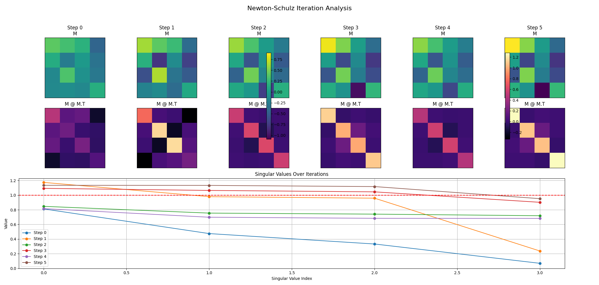

# muon-newton-shultz-research
muon-newton-shultz-research

## Newton-Schulz Iteration Analysis

[English Version](README.md) | [中文版本](README_CN.md)

---

An experiment was conducted to visualize the effect of the `newton_shultz` function on a random 4x4 matrix. The function applies an iterative method to orthogonalize the matrix.

The results are captured in the following image:

### Analysis

The visualization clearly demonstrates that the `newton_shultz` function progressively orthogonalizes the input matrix over 5 iterations. This is evident from two key indicators in the plot:

1.  **Convergence of M @ M.T to Identity:** The middle row of heatmaps visualizes the product of the matrix and its transpose (`M @ M.T`). The plot for Step 0 shows a scattered result, but by Step 5, it has converged to a distinct diagonal line, which is the visual representation of an identity matrix. This behavior directly satisfies the definition of an orthogonal matrix (`Q @ Q.T = I`).

2.  **Convergence of Singular Values to 1:** The bottom plot tracks the singular values of the matrix at each iteration. The values start scattered (Step 0) but rapidly converge towards 1.0 with each step, as shown by the lines clustering around the red dashed line. A matrix is orthogonal if and only if all its singular values are equal to 1.

### What is a Singular Value? (An Intuitive Explanation)

Think of a singular value as a measure of how much a matrix **stretches** or **squishes** things.

Imagine you have a circle. If you apply a 2x2 matrix transformation to every point on that circle, it will become an ellipse. The two **singular values** are the lengths of the two main axes of this new ellipse. They tell you the "stretch factors" of the transformation.

This idea generalizes to higher dimensions. The number of singular values equals the number of rows or columns of the matrix (its rank).

- For a **3x3** matrix, you can imagine it transforming a sphere into an ellipsoid (a 3D football shape). The lengths of its three main axes would be the three singular values.
- In our experiment with a **4x4** matrix, there are **four** singular values. That's why the plot shows four points for each line (one for each singular value).

#### Connection to Orthogonal Matrices

An orthogonal matrix is special because it **only rotates** things; it *never* stretches or squishes them. If there's no stretching in any direction, it means **all** of the "stretch factors" (all singular values) must be exactly **1**.

This is why observing the singular values is a great way to see if a matrix is becoming orthogonal. In our experiment, as the `newton_shultz` function runs, we see all four singular values moving towards 1, which is the tell-tale sign of a successful orthogonalization.

## About This Project

This project demonstrates the fundamental principles of the Newton-Schulz iteration method through experimentation:

- **Core Algorithm**: Implemented in `newton_shultz.py`
- **Experimental Demonstration**: `experiment.py` shows the matrix orthogonalization process visualization
- **Technical Insight**: Understanding orthogonal matrices through singular value analysis

## Technical Details

- **Programming Language**: Python
- **Main Dependencies**: PyTorch, NumPy, Matplotlib
- **Algorithm Complexity**: O(n³) time complexity, suitable for medium-scale matrices
- **Numerical Stability**: Ensured through carefully chosen coefficients

---

[English Version](README.md) | [中文版本](README_CN.md)
